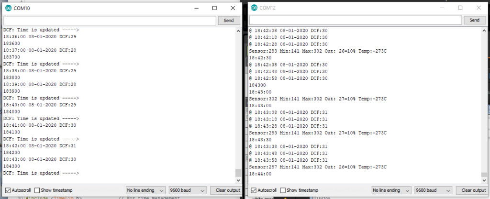
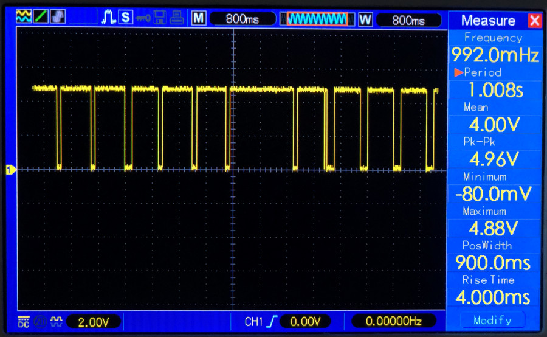
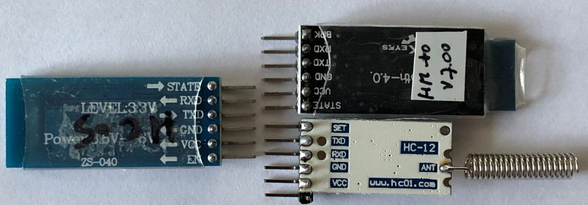
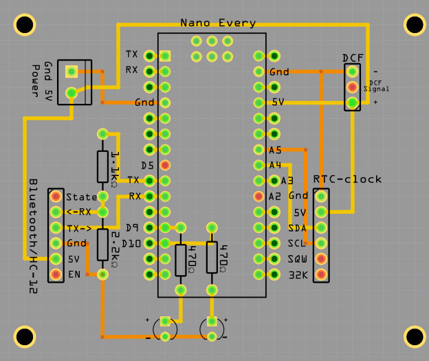
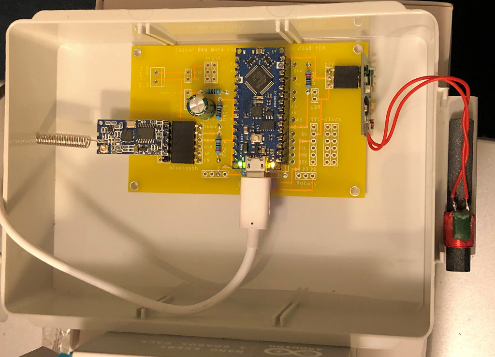
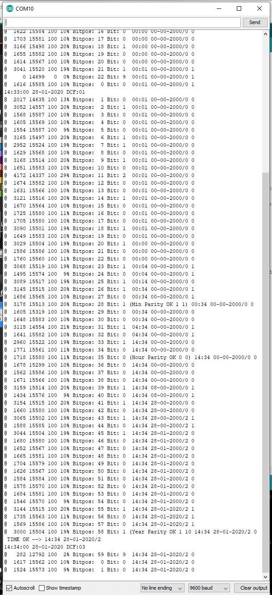

# DCF77_HC12
A HC-12 time transmitter with DCF77 time receiver
<h1 class="auto-style3">Arduino Nano Every as DCF77 time-transmitter  
with HC-12 433 MHz</h1>

 

The <a href="https://store.arduino.cc/arduino-nano-every">Arduino 
Nano Every</a> board is used to decode a 
DCF77-time signal received with a DCF77-ferrite receiver and transmits time and date 
 
with a HC-12 module 
in the air as text. 
The DCF77-signal is a pulse that is send every second into the ether with a length of 0.1 or 0.2 second.  
The short and long pulse represents a 0 and 1. 
When 59 bits are sent the program can extract the time date from this binary 
string. The 60th bit is a second pause without a pulse. 
 
<strong>Using interrupts</strong> 
The standard Arduino DCF77-library of Thijs Ellenbaas was used to setup the 
program. 
Libraries are a good start but a disadvantage is that from one to the other day they are not available 
anymore.  
Because they must be robust and have many functions they often consume more 
program memory than necessary. 
Interrupts are nice but it are interrupts and therefore unpredictable. 

<strong>A different approach</strong> 
Arduino programs runs in a loop. In this loop() input is checked and output 
generated by the subroutines called from within the loop(). 
In our example the DCF77-signal can be read over 15000 time a second in this 
loop.  
Because the pulses are 0.1 or 0.2 second in length they can be easily 
discriminated from each other by just counting the 0 and 1 on the digital pin 
attached to the receiver.  
 
The start time of the counting is irrelevant as long as it is 1000 msec long. It 
is not necessary to wait for the rising or falling edge of the signal. 
Of course there must be enough counts (&gt;1000) in a second. Therefor the program 
may not use delays is one of its functions.  
 
The short pulse of 0.1 second must lie between 5% and 15% of the counts and the 
1 pulse must lie between 15 and 30%. 
As a refinement one can start counting after say 100 successive counts otherwise 
it is a spike. This value will depend of how many counts a second the program 
can read 
This is the variable <em>DCFValidGate</em> in the program.  
 
In the picture below the DCF-signal with the 60 second-gap is shown. 
 
 
The DCF77-signal is disturbed by microwaves, cheap power supplies and other electronics but also by 
WS2812 and SK6812 colour LED's.  
These LED's contain a small chip which frequency disturbs the signal if the 
receiver is close by. 
Also receivers that receive DCF49- , DCF39-&nbsp; and HGA22-signals are interfered by these chips. 
These RGB-colour chips are used in my <a href="https://ednieuw.nl">word clocks</a>.
 
In contrast with the other modules like the <a href="https://www.mysensors.org/about/components">NRF24L01</a> 
and several 433 and 866 MHZ Transmitter/Receivers the <a href="https://howtomechatronics.com/tutorials/arduino/arduino-and-hc-12-long-range-wireless-communication-module/">HC-12 module</a> was very easy to implement and worked 
directly without complicated coding. It behaves as an ordinary RS232-connection. 
It can also easily be exchanged with HM-05 and HM10 Bluetooth modules without changing the connections and program code. 
The <a href="https://github.com/thijse/Arduino-DCF77">DCF-77 library of Thijs Ellenbaas</a> uses an interrupt routine to detect the signal. A tricky thing 
about interrupts is that the trigger is processor dependent and does not work on all pins in the ATMEGA chips.  
The usage of the <a href="https://store.arduino.cc/arduino-nano-every">Arduino 
Nano Every</a>&nbsp; was an experiment to see of the time transmitter would work 
with it.  
As expected the interrupts were different. For an Arduino Uno and Nano the interrupt number for pin 2 is 0&nbsp;and for the Nano Every 
interrupt number is 2. 
 
<strong>The hardware</strong> 
The connections are simple. I used one of the PCB's that are used for the <a href="https://github.com/ednieuw/Fibonacci-Vierkantekokerklok">Fibonacci</a> and 
<a href="[https://github.com/ednieuw/Word-Colour-Clock-SK6812-WS2812">Word</a> clocks. 
<a href="Colour%20Word%20Clock%20PCBV08-HC-12-DCF77.fzz">The Fritzing file is here</a> 
The HC-12 module has similar connections as the HC-05 and HM-10 Bluetooth modules. 
Only RX and TX are reversed but this is taken care of in the coding.
<pre>
HC_12TX      = 6,    // HC-12 TX Pin
HC_12RX      = 7,    // HC-12 RX Pin </pre>

  
The 1.1K/2.2K voltage divider can be left out. Because several Bluetooth modules are not 5V tolerant a voltage divider is on this PCB to reduce the voltage to 3.3V.
 
The HC-12 can be connected directly to the Arduino pins but works also fine with the voltage divider. RX to TX and TX to RX! 
On <a href="https://www.allaboutcircuits.com/projects/understanding-and-implementing-the-hc-12-wireless-transceiver-module/">
this page the HC-12</a> and its programming is clearly explained (<a href="Implementing%20the%20HC-12%20Wireless%20transceiver.html">or 
use this link if the site has become obsolete</a>)

 
<table style="width: 950px">
	<tr>
		<td valign="bottom">
		</td>
		<td valign="bottom">
		</td>
	</tr>
	<tr>
		<td valign="bottom">
		<a href="Colour%20Word%20Clock%20PCBV08-HC-12-DCF77.fzz" class="auto-style1">Fritzing PCB</a></td>
		<td valign="bottom">The transceiver running</td>
	</tr>
</table>
 
<strong>The program</strong> 
Can be download here:&nbsp; 
<a href="DCF_HC12TransmitterV06.ino">
DCF_HC12TransmitterV06</a> 
The libraries needed: <a href="Libraries.zip">Libraries.zip</a> 
Copy the libraries Adafruit_BusIO, DCF77, NewliquidCrystal, RTClib and Time in the folder named 'libraries' located in your sketch folder 
The libraries EEPROM, HID, SoftwareSerial, SPI and Wire are standard default Arduino libraries. Use them only if the compiler can not find them.

With the #define modules cq coding can be used or disabled.  
If no DS3231 module is installed the program uses the Arduino clock. This is fine when the DCF-receiver is working fine 
In this case no LCD is installed.

<pre>#define DCFMOD           // Use the Arduino DCF77 library with interrupts
#define DCFTINY          // Use the Tiny DCF algorithm in this program
#define HC12MOD          // Use HC12 time transreceiver Long Range Wireless Communication Module
//#define LCDMOD           // LCD 2 x 16 installed 
#define MOD_DS3231       // DS3231 RTC module installed</pre>

After declarations, initialisations and the setup 
subroutine the program enters the loop.

<strong>The loop</strong> is very simple&nbsp;

<pre>void loop(void)
{
 SerialCheck();
 EverySecondCheck();
 EveryMinuteUpdate();
                              #ifdef DCFMOD         
 DCF77Check();
                              #endif DCFMOD
}</pre>
The Serial- and DCF77-input is checked every loop and in this program that is over 15000 times a second.
In the EverySecondCheck routine the difference between the last time the routine was entered must be greater than 0.999 seconds.
After 50 msec the seconds tick LED is turned of. With the #ifdef part of the program are compiled or not compiled.  
It is wise to leave out program code for parts that are not used. It can only interfere and makes the program larger.
<pre>
<strong>Every second
</strong>void EverySecondCheck(void)
{
 if ( millis() - msTick &gt; 50)   { digitalWrite(secondsPin,LOW);}   // Turn OFF the second on pin 13
 if ( millis() - msTick &gt; 999)                                     // Flash the onboard Pin 13 Led so we know something is happening
  {    
   msTick = millis();                                              // second++; 
   digitalWrite(secondsPin,HIGH);                                  // turn ON the second on pin 13
   ++SecPulse;                                                     // second routine in function DimLeds
   GetTijd(0);                                                     // synchronize time with RTC clock      
                           #ifdef LCDMOD
   Print_tijd_LCD();
                           #endif LCDMOD  
                           #ifdef HC12MOD  // disabled with the x HC12MODx
   if( (Inow.second()==10) )               // When HC12 sends it disturbs DCF-signal. In seconds 1 - 19 are whether info bits
    {                                      // Now we can send some info
     sprintf(sptext,"@ %0.2d:%0.2d:%0.2d %0.2d-%0.2d-%0.4d DCF:%0.2d",
            Inow.hour(),Inow.minute(),Inow.second(),Inow.day(),Inow.month(),Inow.year(),DCF_signal);
     HC12.print(sptext);     
    }    
                            #endif HC12MOD
  }
}</pre>
 <class="auto-style1"><strong>Decoding the DCF77-signal</strong>
In the DCF77Check() routine the signal of the DCF77 is updated.
The Arduino library working with interrupts gives a DCFtime==TRUE if a valid time is calculated
In the case of the DCFtiny routine the digital signals are counted and every minute <a href="https://en.wikipedia.org/wiki/DCF77">decoded in UpdateDCFclock()</a>.

A scarcely used "if then else" is used in this routine:
<pre>    if (LastGateValid &gt; DCFValidGate ? SumSecondignal++ : DiscardedSignals++ );
    if (True ? then : else);</pre>
<pre>//--------------------------------------------
void DCF77Check(void)
{
 byte LHbit = 1 - digitalRead(DCF_PIN);        // write inverted DCF pulse to LED on board 
 digitalWrite(DCF_LED_Pin, LHbit ); 
                             #ifdef DCFMOD
 time_t DCFtime = DCF.getTime();               // Check if new DCF77 time is available
 if (DCFtime!=0)
  {
   Tekstprintln("DCF: Time is updated -----&gt;  ");
   sprintf(sptext,"%0.2d%0.2d%0.2d",Inow.hour(),Inow.minute(),Inow.second());
   Tekstprintln(sptext); 
   DCF_signal+=2;
   setTime(DCFtime); 
   RTCklok.adjust(DCFtime);
//   Ellenbaas++;
  }
                             #endif DCFMOD                             
                             #ifdef DCFTINY
 SumSignalCounts += 1;                         // Noof of counted signals  
 if(LHbit) 
   {
    LastGateValid++; 
    if (LastGateValid &gt; DCFValidGate ? SumSecondSignal++ : DiscardedSignals++ );
   }
 if ( millis() - DCFmsTick &gt; 999)              // Compute every second the received DCF-bit to a time 
    { 
      DCFmsTick = millis(); 
      if(byte OKstatus = UpdateDCFclock())     // if after 60 sec a valid time is calculated, sent it to the HC-12 module
         {
          if(OKstatus == 2)                    // if time flag was OK and date flag was NOK
            {
             sprintf(sptext," TIME OK --&gt; %0.2d:%0.2d",Dhour, Dminute );
             Serial.println(sptext);
             RTCklok.adjust(DateTime(Inow.year(), Inow.month(), Inow.day(), Dhour, Dminute, 0));
            }
           else                                // if time flag was OK and date flag also OK  (OKstatus == 1)
            {
            sprintf(sptext," TIME OK --&gt; %0.2d:%0.2d %0.2d-%0.2d-%0.4d/%0.1d",Dhour, Dminute, Dday, Dmonth, 2000+Dyear, Dwday );
            Serial.println(sptext);
            RTCklok.adjust(DateTime(2000+Dyear, Dmonth, Dday, Dhour, Dminute, 0));
            }         
          DCF_signal+=2;
 //         Ed++;
         }
    } 
                             #endif DCFTINY                  
 DCF_signal = constrain(DCF_signal,0 ,100);    // DCF_signal &lt;100
 analogWrite(DCFgood, DCF_signal); 
} 
                             #ifdef DCFTINY
//--------------------------------------------
// CLOCK Make the time from the received DCF-bits
//--------------------------------------------
byte UpdateDCFclock(void)
{
 byte TimeOK;              // return flag is proper time is computed
 if (Bitpos &gt;= 60) {Bitpos=0; StartOfMinute = 0;} 
 if (PrintDebugInfo)
    { 
    sprintf(sptext,"@ %5ld %5ld %3ld %2ld%% Bitpos: %2d",
    SumSecondSignal, SumSignalCounts, DiscardedSignals,  100 * SumSecondSignal/ SumSignalCounts, Bitpos );
    Serial.print(sptext);
    }  
 if (SumSignalCounts&gt;5000 &amp;&amp; SumSecondSignal&lt;500) Bitpos = 59;    // if enough signals the one second no signal is found. this is position zero
 Receivebit = 9;
 int msec = (int)1000 * SumSecondSignal/ SumSignalCounts;   
 switch(msec)
  {
   case   0 ...  50:  Receivebit = 9; break;  // if signal is less than 0.05 sec long than it is nothing
   case  51 ... 150:  Receivebit = 0; break;  // if signal is 0.1 sec long than it is a 0 
   case 151 ... 250:  Receivebit = 1; break;  // if signal is 0.1 sec long than it is a 1 
   default:           Receivebit = 2; break;  // in all other cases it is an error
  }
 if (PrintDebugInfo){ sprintf(sptext," Bit: %1d ",Receivebit );   Serial.print(sptext);}
 switch (Bitpos)                              // Ddecode the 59 bits to a time and date.
  {                                           // It is not binary but "Binary-coded decimal" 
                                              // and blocks are checked with an even parity bit. 
   case   0: if(Receivebit==0)       StartOfMinute = 1;                    break; // Bit must always be 0
   case   1 ... 19: Paritybit = 0;                                         break;
   case  20: if(Receivebit==1)
               {
                StartOfEncodedTime = 1;                      // Bit must always be 1
                Dsecond = Dminute = Dhour = Dday =Dwday = Dmonth = Dyear = 0;
                }
              else StartOfEncodedTime = 0;
                                                                           break;
   case  21: if(Receivebit==1) {Dminute  = 1;  Paritybit = 1 - Paritybit;} break;
   case  22: if(Receivebit==1) {Dminute += 2 ; Paritybit = 1 - Paritybit;} break;
   case  23: if(Receivebit==1) {Dminute += 4 ; Paritybit = 1 - Paritybit;} break;
   case  24: if(Receivebit==1) {Dminute += 8 ; Paritybit = 1 - Paritybit;} break;
   case  25: if(Receivebit==1) {Dminute += 10; Paritybit = 1 - Paritybit;} break;
   case  26: if(Receivebit==1) {Dminute += 20; Paritybit = 1 - Paritybit;} break;
   case  27: if(Receivebit==1) {Dminute += 40; Paritybit = 1 - Paritybit;} break;
   case  28: if(Receivebit==Paritybit) 
               {
                 if (PrintDebugInfo)
                  {                
                   sprintf(sptext,"(Min Parity OK %d %d)" ,Receivebit, Paritybit);
                   Serial.print(sptext);
                  }
                MinOK = 1;
               }
                else 
               {
                 if (PrintDebugInfo)
                  {                
                   sprintf(sptext,"(Min Parity NOK %d %d)",Receivebit, Paritybit);
                   Serial.print(sptext);
                  }
                MinOK = 0;
               }           
             Paritybit = 0;                                               break;  
   case  29: if(Receivebit==1) {Dhour   =  1; Paritybit = 1 - Paritybit;} break;
   case  30: if(Receivebit==1) {Dhour  +=  2; Paritybit = 1 - Paritybit;} break;
   case  31: if(Receivebit==1) {Dhour  +=  4; Paritybit = 1 - Paritybit;} break;
   case  32: if(Receivebit==1) {Dhour  +=  8; Paritybit = 1 - Paritybit;} break;
   case  33: if(Receivebit==1) {Dhour  += 10; Paritybit = 1 - Paritybit;} break;
   case  34: if(Receivebit==1) {Dhour  += 20; Paritybit = 1 - Paritybit;} break;
   case  35: if(Receivebit==Paritybit) 
                {
                 if (PrintDebugInfo)
                   {
                    sprintf(sptext,"(Hour Parity OK %d %d)", Receivebit, Paritybit);
                    Serial.print(sptext);
                   }                        
                  HourOK = 1;
                }
               else 
                {
                  if (PrintDebugInfo)
                   {
                    sprintf(sptext,"(Hour Parity NOK %d %d)",Receivebit, Paritybit); 
                    Serial.print(sptext);
                   }                  
                  HourOK = 0;
                }               
             Paritybit = 0;                                              break;  
   case  36: if(Receivebit==1) {Dday    =  1; Paritybit = 1 - Paritybit;} break;
   case  37: if(Receivebit==1) {Dday   +=  2; Paritybit = 1 - Paritybit;} break;
   case  38: if(Receivebit==1) {Dday   +=  4; Paritybit = 1 - Paritybit;} break;
   case  39: if(Receivebit==1) {Dday   +=  8; Paritybit = 1 - Paritybit;} break;
   case  40: if(Receivebit==1) {Dday   += 10; Paritybit = 1 - Paritybit;} break;
   case  41: if(Receivebit==1) {Dday   += 20; Paritybit = 1 - Paritybit;} break;
   case  42: if(Receivebit==1) {Dwday   =  1; Paritybit = 1 - Paritybit;} break;
   case  43: if(Receivebit==1) {Dwday  +=  2; Paritybit = 1 - Paritybit;} break;
   case  44: if(Receivebit==1) {Dwday  +=  4; Paritybit = 1 - Paritybit;} break;
   case  45: if(Receivebit==1) {Dmonth  =  1; Paritybit = 1 - Paritybit;} break;
   case  46: if(Receivebit==1) {Dmonth +=  2; Paritybit = 1 - Paritybit;} break;
   case  47: if(Receivebit==1) {Dmonth +=  4; Paritybit = 1 - Paritybit;} break;
   case  48: if(Receivebit==1) {Dmonth +=  8; Paritybit = 1 - Paritybit;} break;
   case  49: if(Receivebit==1) {Dmonth += 10; Paritybit = 1 - Paritybit;} break;
   case  50: if(Receivebit==1) {Dyear   =  1; Paritybit = 1 - Paritybit;} break;
   case  51: if(Receivebit==1) {Dyear  +=  2; Paritybit = 1 - Paritybit;} break;
   case  52: if(Receivebit==1) {Dyear  +=  4; Paritybit = 1 - Paritybit;} break;
   case  53: if(Receivebit==1) {Dyear  +=  8; Paritybit = 1 - Paritybit;} break;
   case  54: if(Receivebit==1) {Dyear  += 10; Paritybit = 1 - Paritybit;} break;
   case  55: if(Receivebit==1) {Dyear  += 20; Paritybit = 1 - Paritybit;} break;
   case  56: if(Receivebit==1) {Dyear  += 40; Paritybit = 1 - Paritybit;} break;
   case  57: if(Receivebit==1) {Dyear  += 80; Paritybit = 1 - Paritybit;} break;
   case  58: if(Receivebit==Paritybit) 
               {
                 if (PrintDebugInfo)
                   { 
                    sprintf(sptext,"(Year Parity OK %d %d0", Receivebit, Paritybit );
                    Serial.print(sptext);
                   }
                 YearOK = 1;
               }
             else
               {
                if (PrintDebugInfo)
                  {
                   sprintf(sptext,"(Year Parity NOK %d %d)",Receivebit, Paritybit ); 
                   Serial.print(sptext);
                  }
                 YearOK = 0;
               }
              Paritybit = 0;                                              break;  
    case  59: //Serial.print("silence");
    default:                                                              break;
   }
 Bitpos++;
 if (PrintDebugInfo)
    {
     sprintf(sptext," %0.2d:%0.2d %0.2d-%0.2d-%0.4d/%0.1d %d",Dhour, Dminute, Dday, Dmonth, 2000+Dyear, Dwday, Paritybit);
     Serial.println(sptext);
    }
 SumSecondSignal = SumSignalCounts = DiscardedSignals = LastGateValid = DiscardedSignals = 0;
 if(Bitpos == 59)
   {
   if(StartOfEncodedTime &amp;&amp; MinOK &amp;&amp; HourOK &amp;&amp; YearOK)
     {                                          // check is the time differ only one minute from the previous time
      uint32_t TimeNow = (((((Dyear * 12 + Dmonth) * 31) + Dday) * 24) + Dhour) * 60 + Dminute;
//      sprintf(sptext," Time now  %ld  :: Previous  %ld",TimeNow , TimePrevious); Serial.println(sptext);
      if(TimeNow - TimePrevious &lt;= 2)           // Time is valid if difference with previous time is one minute
        {
         TimeOK = 1;    
        }
      TimePrevious = TimeNow;      
      } 
    else                                        // Time is not valid
      {
       if(StartOfEncodedTime &amp;&amp; MinOK &amp;&amp; HourOK)
         {                                      // check is the time differ only one minute from the previous time
          uint32_t TimeNow = Dhour * 60 + Dminute; 
                                                // sprintf(sptext," HourMinTime now  %ld  :: Previous  %ld",TimeNow , HourMinPrevious); Serial.println(sptext);
          if(abs(TimeNow - HourMinPrevious &lt;= 2))    // Time is valid if difference with previous time is one minute
            {
             TimeOK = 2;    
            }
          HourMinPrevious = TimeNow;         
          }
        else                                    // if no vslid time stamp add one minute to time previous
          {
           TimePrevious++;
           TimeOK = 0;       
          }
       } 
   }                                            // --- end if(Bitpos == 59)
return(TimeOK);
}                 
                             #endif DCFTINY</pre>

<strong>Rounding up</strong> 

The rest of the program explains it self.  
The definition below takes care of the interrupt pin definition of the Nano 
Every and other Arduino's. 

<pre>                    #ifdef ARDUINO_AVR_NANO_EVERY
#define DCF_INTERRUPT 2               // DCF Interrupt number associated with DCF_PIN ( 2 Nano Every)
                    #else if
#define DCF_INTERRUPT 0              // Nano Uno etc 
                    #endif      
DCF77 DCF = DCF77(DCF_PIN,DCF_INTERRUPT,LOW);
                    #endif DCFMOD </pre>
<pre>It is possible to use both DCF decoding routines simultaneously or one of the two. 
//#define DCFMOD           // Use the Arduino DCF77 library with interrupts
#define DCFTINY          // Use the Tiny DCF algorithm in this program</pre>
Entering a letter A in the serial monitor switches on and off de debugger for the DCFtiny decoding 
algorithm. 
If all the parities are OK and time differs one or two minutes from the previous 
time, date and time are send 
If only time parities are OK time is send and not the date. 
 
The DCFtiny generates earlier and more valid time results than the interrupt 
library. 
DCFtiny is probably a little less robust then the interrupt library. 
But checking if the received time string from the HC12-transmitter is valid is 
almost obligatory until an CRC-check is 
built in the transmission sentence.  
 
 
<strong>@ pos cnt tot cnt, DCFValidGate, length%, 
bitpos, bit value, compiled time, compiled date/weekday, parity bit</strong> 
 
 

Links

<a href="http://www.brettoliver.org.uk/DCF77_Analyzer_Clock/DCF77_Analyzer_Clock.htm">
Arduino DCF77 Signal Analyzer Clock </a>
 

<a href="http://www.hansonline.eu/service/rc.htm">
Radio Controlled (RC) of Funk klokken</a> 
<a href="https://arduino-projekte.webnode.at/meine-projekte/">
Meine Arduino-Projekte </a>
 

<a href="http://www.dcf77logs.de/WebConsole.aspx" style="color: rgb(0, 102, 204); font-family: Verdana,Geneva,Tahoma,sans-serif; font-size: 16px; font-style: normal; font-variant: normal; font-weight: 400; letter-spacing: normal; orphans: 2; text-align: left; text-decoration: underline; text-indent: 0px; text-transform: none; -webkit-text-stroke-width: 0px; white-space: normal; word-spacing: 0px;">
Online signal from Mainflingen on website</a> 

Explains the bits in the received string 
<a href="http://arduino-projects4u.com/home-weather-station/" style="color: rgb(0, 102, 204); font-family: Verdana,Geneva,Tahoma,sans-serif; font-size: 16px; font-style: normal; font-variant: normal; font-weight: 400; letter-spacing: normal; orphans: 2; text-align: left; text-decoration: underline; text-indent: 0px; text-transform: none; -webkit-text-stroke-width: 0px; white-space: normal; word-spacing: 0px;">
Arduino projects 4you</a> 

HKW-Elektronik GmbH&nbsp; 
<a href="http://www.hkw-shop.de/Empfangstechnik-AM/" style="color: rgb(0, 102, 204); font-family: Verdana,Geneva,Tahoma,sans-serif; font-size: 16px; font-style: normal; font-variant: normal; font-weight: 400; letter-spacing: normal; orphans: 2; text-align: left; text-decoration: underline; text-indent: 0px; text-transform: none; -webkit-text-stroke-width: 0px; white-space: normal; word-spacing: 0px;">
Sells all kinds of receivers</a> 
<a href="http://www.hjberndt.de/soft/rtctftdcf.html" style="color: rgb(0, 102, 204); font-family: Verdana,Geneva,Tahoma,sans-serif; font-size: 16px; font-style: normal; font-variant: normal; font-weight: 400; letter-spacing: normal; orphans: 2; text-align: left; text-decoration: underline; text-indent: 0px; text-transform: none; -webkit-text-stroke-width: 0px; white-space: normal; word-spacing: 0px;">
Rheinturmfunkuhr mit 
Arduino </a>
 
<a href="https://gonium.net/md/2006/11/05/arduino-dcf77-radio-clock-receiver/index.html" style="color: rgb(0, 102, 204); font-family: Verdana,Geneva,Tahoma,sans-serif; font-size: 16px; font-style: normal; font-variant: normal; font-weight: 400; letter-spacing: normal; orphans: 2; text-align: left; text-decoration: underline; text-indent: 0px; text-transform: none; -webkit-text-stroke-width: 0px; white-space: normal; word-spacing: 0px;">
Arduino DCF77 radio clock receiver ,Matthias 
Dalheimer </a>
 
<a href="https://github.com/thijse/" style="color: rgb(0, 102, 204); font-family: Verdana,Geneva,Tahoma,sans-serif; font-size: 16px; font-style: normal; font-variant: normal; font-weight: 400; letter-spacing: normal; orphans: 2; text-align: left; text-decoration: underline; text-indent: 0px; text-transform: none; -webkit-text-stroke-width: 0px; white-space: normal; word-spacing: 0px;">
Github Thijs Elenbaas</a> 

<a href="http://www.conrad.com/ce/en/product/641138/DCF-receiver-board" style="color: rgb(0, 102, 204); font-family: Verdana,Geneva,Tahoma,sans-serif; font-size: 16px; font-style: normal; font-variant: normal; font-weight: 400; letter-spacing: normal; orphans: 2; text-align: left; text-decoration: underline; text-indent: 0px; text-transform: none; -webkit-text-stroke-width: 0px; white-space: normal; word-spacing: 0px;">
Conrad receiver</a> 
<a href="https://www.makerguides.com/tm1637-arduino-tutorial/">TM1637 4 Digit 7 
Segment Display Arduino Tutorial </a> 
<a href="https://www.allaboutcircuits.com/projects/understanding-and-implementing-the-hc-12-wireless-transceiver-module/">
Understanding and Implementing the HC-12 Wireless Transceiver Module</a> 

&nbsp;

February 2020

<a href="../../email.html">Ed Nieuwenhuys</a> 

